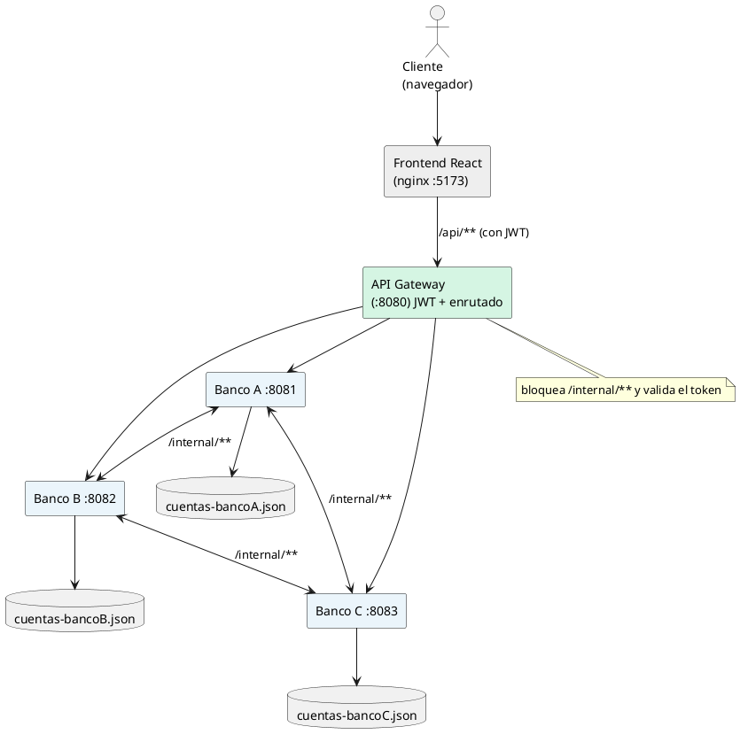
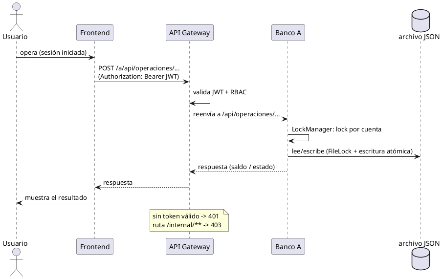
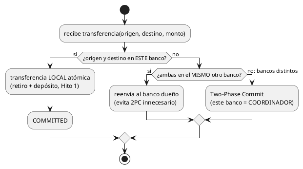
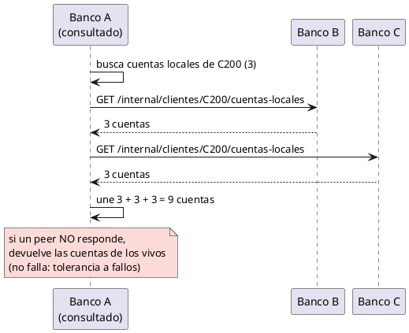
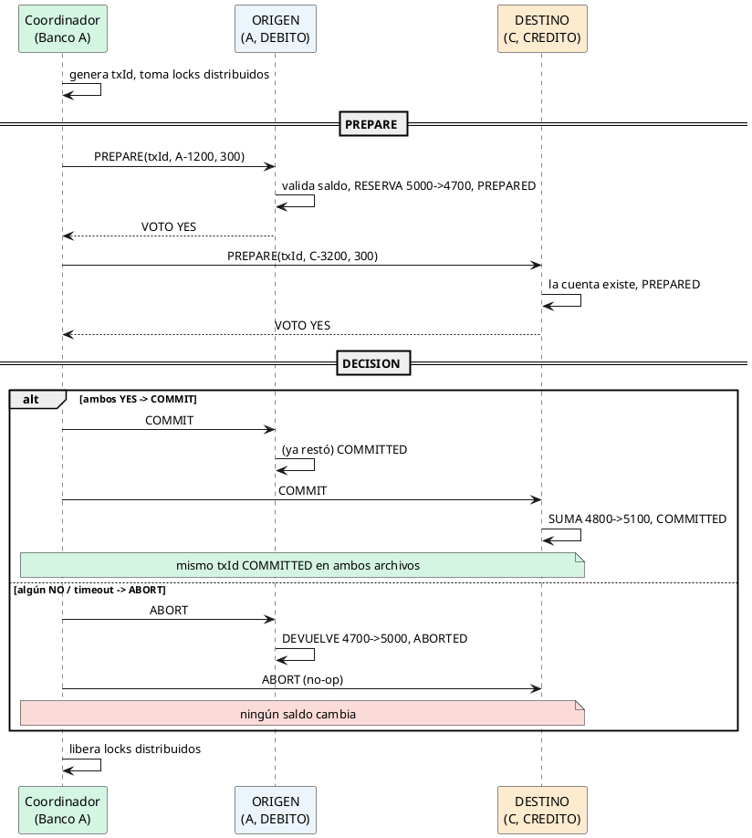
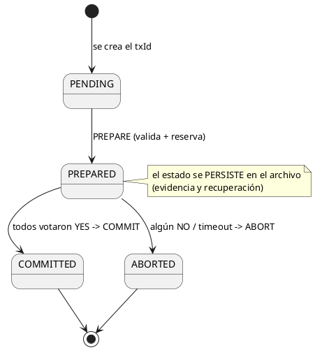
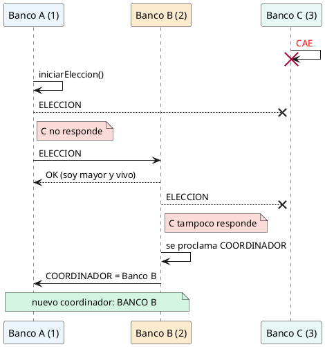
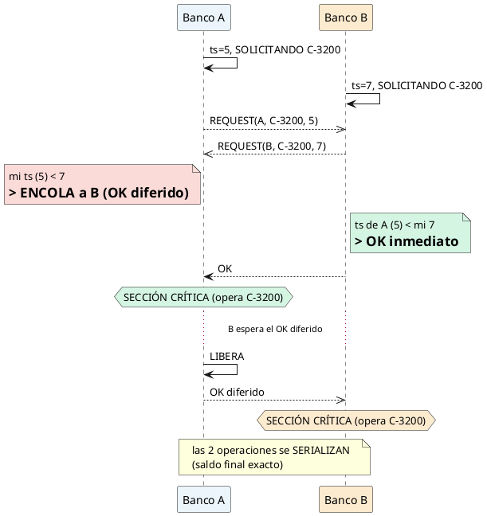
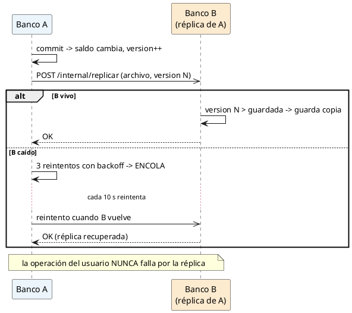

# Diagramas PlantUML — Funcionalidad del Sistema Bancario Distribuido

Colección para **entender cómo funciona** el proyecto. Renderiza cada uno en
**https://www.plantuml.com/plantuml/uml** (pega el código → guarda el PNG).

Orden: de lo más general (arquitectura, recorrido de una petición) a lo más específico
(2PC, elección, exclusión mutua, replicación, estados).

---

## 1. Arquitectura general (¿qué piezas hay y cómo se conectan?)

---

## 2. Recorrido de una petición de punta a punta (¿por dónde pasa una operación?)

---

## 3. Decisión de una transferencia (¿cómo elige el sistema qué hacer?)

---

## 4. Vista global de cuentas (¿cómo ve el cliente sus 9 cuentas desde un solo banco?)

---

## 5. Two-Phase Commit — commit y abort (¿cómo es atómica una transferencia entre bancos?)

---

## 6. Estados de una transacción (¿por qué estados pasa un txId?)

---

## 7. Elección de coordinador — Bully (¿quién manda si cae un nodo?)

---

## 8. Exclusión mutua — Ricart–Agrawala (¿cómo no se corrompe una cuenta compartida?)

---

## 9. Replicación y tolerancia a fallos (¿cómo se respaldan los archivos y qué pasa si cae un nodo?)

